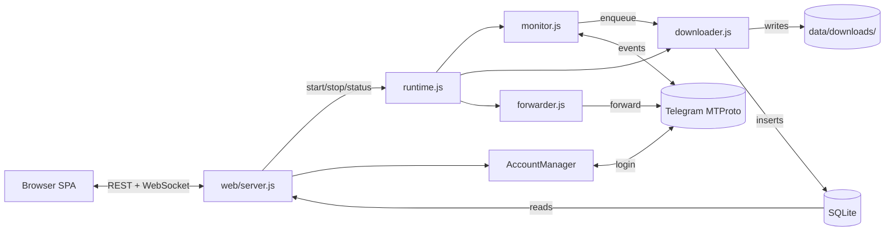

# Telegram Media Downloader — self-hosted, free, MIT

Download photos, videos, documents, voice messages, GIFs, stickers, and Stories from any Telegram channel, group, or chat your account can read. Bulk-archive a whole channel, paste a `t.me/` link to grab a single message, capture self-destructing media before it expires, and forward downloads automatically to another chat. Web dashboard plus a CLI for headless servers. Runs on Windows, Linux, macOS, and Docker.

[](https://github.com/botnick/telegram-media-downloader/actions/workflows/ci.yml)
[](https://github.com/botnick/telegram-media-downloader/actions/workflows/codeql.yml)
[](./LICENSE)
[](https://nodejs.org/)
[](https://github.com/botnick/telegram-media-downloader/pkgs/container/telegram-media-downloader)

> **Keywords:** Telegram downloader · Telegram channel scraper · Telegram media backup · download Telegram videos · download Telegram photos · Telegram archive tool · self-hosted Telegram bot alternative · GramJS · MTProto · Telegram Stories downloader · Telegram private channel downloader · t.me link downloader · Telegram TTL self-destruct downloader.

> [Quick start](#quick-start) · [Architecture](docs/ARCHITECTURE.md) · [API](docs/API.md) · [Deploy](docs/DEPLOY.md) · [Troubleshooting](docs/TROUBLESHOOTING.md) · [Audit](docs/AUDIT.md)

### One-click deploy

| Provider | Button |
| --- | --- |
| **Render** | [](https://render.com/deploy?repo=https://github.com/botnick/telegram-media-downloader) |
| **Railway** | [](https://railway.app/template/?template=https://github.com/botnick/telegram-media-downloader) |
| **Fly.io / Docker** | `docker run --pull=always -p 3000:3000 -v "$(pwd)/data:/app/data" ghcr.io/botnick/telegram-media-downloader:latest` |

After the container is up, open `:3000` and the in-browser setup wizard takes over (set password → enter API creds → add account → download).

### Architecture at a glance



Detail in [`docs/ARCHITECTURE.md`](docs/ARCHITECTURE.md).

---

## What is Telegram Media Downloader?

A self-hosted application that watches your Telegram chats and downloads new media to disk automatically. Built on the **Telegram User API (MTProto via [GramJS](https://github.com/gram-js/gramjs))** — not a bot — so it can read any channel, group, supergroup, forum topic, or DM your Telegram account is a member of, including private ones. Files are organised into folders by chat and media type, deduplicated in a local SQLite database, and viewable in a Telegram-themed web dashboard. No quotas, no cloud, no telemetry.

## Why people use it

- **Archive a whole Telegram channel** — bulk-backfill thousands of past messages with date / count filters.
- **Mirror an active channel** — real-time monitor downloads new media the moment it arrives.
- **Save individual messages** — paste a `https://t.me/...` link, get the media into your library.
- **Save Stories** — pull active Stories from any user by username.
- **Capture self-destructing media** — TTL messages are fast-pathed to the front of the queue and stored locally before they expire.
- **Avoid Telegram bot limits** — User API has no 50 MB / 4 GB ceiling that the Bot API imposes.
- **Forward as you download** — auto-forward to another channel, group, or Saved Messages.
- **Run on a NAS / VPS / Raspberry Pi** — Docker image is multi-arch, < 200 MB, runs as non-root.

## Complete feature list

### Engine
- Realtime monitor across an unlimited number of channels, groups, supergroups, and forum topics.
- Bulk **history backfill** with `last 100 / 1000 / 10000` presets or custom message-count filters.
- **Multi-account routing** — add unlimited Telegram accounts. The engine probes which account can read each chat and pins it automatically; per-group overrides are supported.
- **Smart dual-lane queue** — realtime jobs (priority 1) never starve behind history backfill; TTL / self-destructing media (priority 0) is unshifted to the front.
- **Auto-scaling workers** — 1 to 20 parallel downloads, scales with the queue depth, throttles down on FloodWait.
- **FloodWait-aware** — pauses the right amount of time Telegram tells us to, never more.
- **Atomic downloads** — temp-file then rename, no half-written files on crash.
- **Persistent dedup** — `(group_id, message_id)` unique constraint plus optional `(file_name, file_size)` second-pass dedup.
- **Disk-spillover queue** — over 2000 pending history jobs spill to disk so RAM stays bounded.
- **Auto-forward** — forward each download to a configured destination (channel, group, Saved Messages) with optional delete-after-forward.
- **Encrypted sessions** — AES-256-GCM with per-blob random scrypt salt; sessions live in `data/sessions/<id>.enc`.
- **Account add / remove from the web** — phone → OTP → 2FA wizard, no CLI required.

### Web dashboard
- **Self-hosted on `:3000`** with a Telegram-themed responsive SPA (vanilla ES Modules, no bundler, no build step).
- **Light / dark / auto theme** with `prefers-color-scheme` detection and persistence.
- **Live engine card** — start, stop, queue depth, active workers, uptime; updates over WebSocket.
- **Sticky status bar** — monitor state, queue, active, total files, disk usage, WebSocket health.
- **Media gallery** — infinite scroll, lazy loading, type filters (Photos / Videos / Files / Audio).
- **Built-in viewer** — full-screen image zoom, video player with resume position, keyboard nav.
- **Search across all downloads** — server-side LIKE search over filename + group name.
- **Multi-select + bulk delete** — selection mode with “X of Y selected” footer.
- **Paste t.me link** — drop one or many URLs (newline-separated) to download just those messages.
- **Stories drawer** — fetch a username's active Stories, pick which ones to save.
- **Group settings modal** — per-chat media filters (photos, videos, files, voice, gifs, stickers, links), auto-forward destination, monitor / forward account assignment, forum-topic whitelist.
- **History backfill from the modal** — one-tap last 100 / 1k / 10k.
- **Browser notifications** — opt-in toast for download-complete events, with burst coalescing.
- **Dialogs picker covers archived chats and DMs** (DMs gated by an explicit privacy switch).
- **Set / change dashboard password from the browser** — first-run setup wizard, no CLI required.
- **Sign out everywhere** — revoke all active dashboard sessions.

### CLI
- Interactive main menu with arrow-key navigation.
- `monitor`, `history`, `dialogs`, `accounts`, `config`, `settings`, `purge`, `auth`, `migrate`, `web` subcommands.
- Headless watchdog supervisors for production: `runner.js` (cross-platform Node), `runner.sh` (POSIX shell), `watchdog.ps1` (Windows PowerShell). All read `TGDL_RUN` env (default `monitor`).
- Structured logging via `data/logs/*.log` with a noise classifier so gramJS reconnect chatter doesn't drown out real errors. Set `TGDL_DEBUG=1` to see everything.

### Filters & limits
- Per-group toggles for **photos, videos, files / documents, links, voice messages, GIFs, stickers, and URL extraction**.
- Global **download speed limit** (bandwidth throttle) and **concurrent worker** count.
- Per-file size limits for **videos, images, total disk usage** (e.g. `1GB`, `100MB`, `50GB`, `1TB`).
- Per-minute API rate limit (anti-FloodWait), polling interval.
- **SOCKS4 / SOCKS5 / MTProxy** support with username/password/secret + an in-dashboard reachability test.
- **Forum-topic filter** — whitelist specific topic IDs in a forum-style supergroup.

### Security
- **Fail-closed by default.** No password configured → no open access. The dashboard redirects to a setup wizard.
- Passwords stored as **scrypt hashes** with per-password random salt; verified with `crypto.timingSafeEqual`.
- Session cookies are **opaque random tokens**, not the password. `httpOnly + sameSite=strict + secure` (in production).
- `helmet`, **rate-limited login** (10 / 15 min / IP), **256 KB JSON body cap**.
- File serving is **NUL-byte / symlink / path-traversal proof** via `fs.realpath`.
- **WebSocket auth at the upgrade handshake** — unauthenticated connections are dropped before they ever receive a message.
- **CodeQL + Dependabot** scheduled scans.

### Operations
- **Docker image** on GHCR, multi-stage, runs as non-root `node` user, `tini` as PID 1, built-in `HEALTHCHECK` against `/api/auth_check`.
- **GitHub Actions CI** — lint + test on Node 20 & 22 across Ubuntu / Windows / macOS.
- **48 vitest specs** covering URL parsing, AES round-trip + legacy decrypt, scrypt password verify, session tokens, proxy mapping, DB migrations + dedup, name sanitisation.
- **ESLint 9 + Prettier**, `husky` + `lint-staged` pre-commit hooks.
- **Backwards compatibility** — legacy plaintext passwords auto-rehashed on first login; legacy AES `v=1` blobs still decrypt.

---

## Supported file types

Photos (JPEG, PNG, WebP, BMP), videos (MP4, MKV, AVI, MOV, WebM), audio (MP3, M4A, FLAC, WAV, OGG, voice messages), documents (PDF, DOC, DOCX, XLS, XLSX, ZIP, RAR, 7z, TXT, JSON, any other MIME), animated GIFs / MP4 animations, stickers (WebP, TGS), URL extraction from text messages.

## Requirements

- **Node.js 20+** (or Docker — no host Node needed)
- A Telegram **API ID** and **API hash** from <https://my.telegram.org> (free, takes 1 minute)
- Disk space for the media you'll archive

## Quick start

### Docker (recommended)

```bash
git clone https://github.com/botnick/telegram-media-downloader.git
cd telegram-media-downloader
docker compose up -d
```

Open `http://localhost:3000`:

1. Set the dashboard password (first-run setup is local-only).
2. **Settings → Telegram API** — paste your `apiId` and `apiHash`.
3. **Settings → Telegram Accounts → Add account** — phone number, OTP, optional 2FA.
4. **Settings → Engine → Start monitor**, or just paste a `t.me/` link in the top bar.

Pre-built image: `ghcr.io/botnick/telegram-media-downloader:latest`.

### Node

```bash
git clone https://github.com/botnick/telegram-media-downloader.git
cd telegram-media-downloader
npm ci
npm run web        # web dashboard
# or
npm start          # interactive CLI menu
```

Long-running monitor under a watchdog (Linux / macOS): `TGDL_RUN=monitor ./runner.sh`. Windows: `pwsh ./watchdog.ps1`.

## CLI cheatsheet

The dashboard does almost everything. The CLI subcommands stay around for headless servers and emergencies.

| Command | What it does |
| --- | --- |
| `npm start` | **Default.** Opens the dashboard at `http://localhost:3000`. |
| `npm run prod` | Same dashboard but supervised by the watchdog (`runner.js`). |
| `npm run monitor` | Headless real-time monitor for servers (no dashboard UI). |
| `npm run history` | Bulk backfill an existing chat. |
| `npm run auth` | Reset / change the dashboard password from the terminal. |
| `npm run menu` | Full list of subcommands. |

## Configuration

`data/config.json` — self-heals to defaults on load, edited via the dashboard or directly.

```jsonc
{
    "telegram":   { "apiId": "...", "apiHash": "..." },
    "accounts":   [/* populated by the wizard */],
    "groups":     [/* {id, name, enabled, filters, autoForward, topics, monitorAccount?, forwardAccount?} */],
    "download":   { "concurrent": 5, "retries": 5, "maxSpeed": 0, "path": "./data/downloads" },
    "rateLimits": { "requestsPerMinute": 15, "delayMs": { "min": 100, "max": 300 } },
    "diskManagement": { "maxTotalSize": "50GB", "maxVideoSize": null, "maxImageSize": null },
    "proxy":      { "type": "socks5", "host": "...", "port": 1080 },
    "allowDmDownloads": false,
    "web":        { "enabled": true, "passwordHash": { "algo": "scrypt", "...": "..." } }
}
```

## File layout

```
data/
├── config.json
├── db.sqlite              (WAL mode)
├── secret.key             (back this up)
├── web-sessions.json
├── sessions/<id>.enc      (AES-256-GCM per account)
├── photos/<id>.jpg
├── downloads/<sanitised-group-name>/{images,videos,documents,audio,stickers}/
└── logs/network.log
```

`data/secret.key` decrypts every saved session — back it up. Without it, every account has to re-login.

## Security & deployment

- The dashboard fails closed when no password is configured — there is no "open access" default.
- Cookies are `httpOnly + sameSite=strict` (and `Secure` when `NODE_ENV=production`).
- Login is rate-limited; file serving is symlink/NUL-byte proof.
- **Don't expose `:3000` to the public internet.** Put it behind Caddy / nginx / Traefik with TLS — examples in [`docs/DEPLOY.md`](docs/DEPLOY.md).
- Vulnerability reports → [`SECURITY.md`](SECURITY.md).

## Frequently asked questions

**How is this different from a Telegram bot?**
A bot uses the Bot API and is limited to chats it's been added to plus Bot API file-size caps. This tool uses the **User API (MTProto)** — it authenticates as your user account, so it can read everything you can read on your phone, including private channels.

**Will my account get banned?**
Built-in rate limiting (default 15 requests/min) and FloodWait handling minimise risk. Don't lower the rate-limit aggressively or run dozens of accounts on the same IP.

**Can I download from a private channel I'm a member of?**
Yes. If your Telegram account can see it, this tool can download it. The dialogs picker shows every chat — public and private.

**Can I download from a DM (one-on-one chat)?**
Yes, but it's off by default for privacy. Settings → Privacy → "Allow DM downloads" toggles the picker to include DMs.

**Does this run on Windows / macOS / Linux / Raspberry Pi?**
All four. The Docker image is multi-arch (amd64 + arm64). For non-Docker installs you only need Node 20+.

**How do I download just one message from a Telegram link?**
Paste the URL into the dashboard's top-bar "link" drawer. Supports `t.me/<chan>/<msg>`, `t.me/c/<id>/<msg>`, forum-topic links, and `tg://resolve` / `tg://privatepost`.

**Can I download Telegram Stories?**
Yes. Click the camera icon in the top bar, enter a username, and pick which Stories to download.

**Can I capture self-destructing (TTL) media?**
Yes. The realtime monitor detects `media.ttlSeconds` and front-loads the queue so the file is downloaded before it expires.

## Contributing

```bash
npm ci
npm run lint
npm test
```

See [`CONTRIBUTING.md`](CONTRIBUTING.md) for branch / commit conventions.

## License

[MIT](LICENSE).

This software is **not** affiliated with, endorsed by, or sponsored by Telegram. It uses the public Telegram MTProto User API via [GramJS](https://github.com/gram-js/gramjs). Users are responsible for complying with the Telegram Terms of Service and any applicable laws in their jurisdiction.
