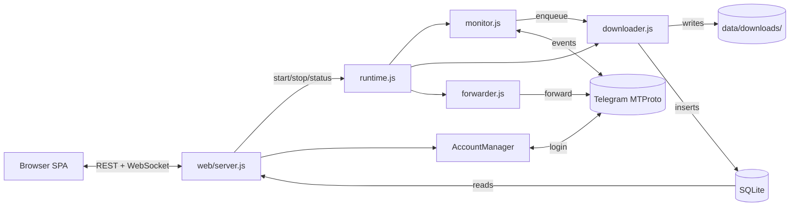

# Telegram Media Downloader — self-hosted, free, MIT

Download photos, videos, documents, voice messages, GIFs, stickers, and Stories from any Telegram channel, group, or chat your account can read. Bulk-archive a whole channel, paste a `t.me/` link to grab a single message, capture self-destructing media before it expires, and forward downloads automatically to another chat. Generate signed share-links friends can open without logging in. One-click in-dashboard auto-update via a watchtower sidecar. Web dashboard plus a CLI for headless servers. Runs on Windows, Linux, macOS, and Docker (amd64 + arm64).

[](https://github.com/botnick/telegram-media-downloader/actions/workflows/ci.yml)
[](https://github.com/botnick/telegram-media-downloader/actions/workflows/codeql.yml)
[](./LICENSE)
[](https://nodejs.org/)
[](https://github.com/botnick/telegram-media-downloader/pkgs/container/telegram-media-downloader)

> **Keywords:** Telegram downloader · Telegram channel scraper · Telegram media backup · download Telegram videos · download Telegram photos · Telegram archive tool · self-hosted Telegram bot alternative · GramJS · MTProto · Telegram Stories downloader · Telegram private channel downloader · t.me link downloader · Telegram TTL self-destruct downloader.

> [Quick start](#quick-start) · [Architecture](docs/ARCHITECTURE.md) · [API](docs/API.md) · [Deploy](docs/DEPLOY.md) · [Troubleshooting](docs/TROUBLESHOOTING.md) · [Audit](docs/AUDIT.md)

### One-click deploy

| Provider | Button |
| --- | --- |
| **Render** | [](https://render.com/deploy?repo=https://github.com/botnick/telegram-media-downloader) |
| **Railway** | [](https://railway.app/template/?template=https://github.com/botnick/telegram-media-downloader) |
| **Fly.io / Docker** | `docker run --pull=always -p 3000:3000 -v "$(pwd)/data:/app/data" ghcr.io/botnick/telegram-media-downloader:latest` |

After the container is up, open `:3000` and the in-browser setup wizard takes over (set password → enter API creds → add account → download).

### Architecture at a glance



Detail in [`docs/ARCHITECTURE.md`](docs/ARCHITECTURE.md).

---

## What is Telegram Media Downloader?

A self-hosted application that watches your Telegram chats and downloads new media to disk automatically. Built on the **Telegram User API (MTProto via [GramJS](https://github.com/gram-js/gramjs))** — not a bot — so it can read any channel, group, supergroup, forum topic, or DM your Telegram account is a member of, including private ones. Files are organised into folders by chat and media type, deduplicated in a local SQLite database, and viewable in a Telegram-themed web dashboard. No quotas, no cloud, no telemetry.

## Why people use it

- **Archive a whole Telegram channel** — bulk-backfill thousands of past messages with date / count filters.
- **Mirror an active channel** — real-time monitor downloads new media the moment it arrives.
- **Save individual messages** — paste a `https://t.me/...` link, get the media into your library.
- **Save Stories** — pull active Stories from any user by username.
- **Capture self-destructing media** — TTL messages are fast-pathed to the front of the queue and stored locally before they expire.
- **Avoid Telegram bot limits** — User API has no 50 MB / 4 GB ceiling that the Bot API imposes.
- **Forward as you download** — auto-forward to another channel, group, or Saved Messages.
- **Share without logging in** — admin generates HMAC-signed `/share/<id>` URLs that friends can open or feed to a download manager (TTL configurable, including "never expires").
- **Backup off-host** — multi-provider mirror to S3-compatible storage (AWS / R2 / B2 / MinIO / Wasabi), an SFTP NAS, or a local mount. Continuous mirror as new files arrive, scheduled tar.gz snapshots, optional client-side AES-256-GCM encryption, persistent retry queue.
- **Find duplicates** — SHA-256 dedup at download time + on-demand library scan.
- **Sort 18+ vs not-18+** — opt-in in-process classifier (`@huggingface/transformers`, WASM, runs everywhere) flags photos that don't match the rest of the library so they can be reviewed and purged.
- **Local AI search & smart organisation** — opt-in CLIP semantic search ("show me beach photos"), face clustering (the **People** view), perceptual near-duplicate dedup, and ImageNet auto-tagging. Everything runs locally via WASM; no cloud APIs, no uploads. See [docs/AI.md](docs/AI.md).
- **One-click update** — opt-in watchtower sidecar lets the dashboard pull-and-recreate the container itself; data volume + DB are preserved (DB is snapshotted to `data/backups/` first).
- **Right-click context menu, drag-drop URL, pinned items, picture-in-picture, mini-player, bulk-zip download, system notifications, wake lock, sunset/sunrise theme, customisable keyboard shortcuts** — gallery is a real desktop-class library, not a list of links.
- **Hash worker pool, HTTP compression, immutable static caching, modulepreload** — fast on a Pi 4 / NAS too. Multi-GB SHA-256 hashing runs on a `worker_threads` pool, `compression` middleware halves text-payload bytes on the wire, static assets serve with 1-year `immutable` Cache-Control behind a `?v=` cache-bust.
- **Run on a NAS / VPS / Raspberry Pi** — Docker image is multi-arch, runs as non-root.

## Complete feature list

### Engine
- Realtime monitor across an unlimited number of channels, groups, supergroups, and forum topics.
- **Monitor auto-starts** when at least one account is logged in — no manual "Start" click needed after a restart.
- **Smart-resume backfill** — `iterMessages` skips already-stored ranges via `maxId/minId` instead of walking the whole timeline. Resuming a partial backfill is roughly an order of magnitude faster than re-walking + per-message dedup.
- **Auto-backfill on first add** — enabling a brand-new group with zero stored rows triggers a background pull of the most recent N messages (default 100, configurable, 0 = disabled).
- **Auto catch-up after restart** — monitor's boot-time inspection spawns a `catch-up` backfill when the gap between the last stored row and Telegram's current top exceeds the threshold.
- **Per-group lock** — only one backfill per group at a time; a duplicate request returns 409 with `code: 'ALREADY_RUNNING'`.
- **Backfill modes** surfaced over WS for the UI: `pull-older` / `catch-up` / `rescan`.
- **Multi-account routing** — add unlimited Telegram accounts. The engine probes which account can read each chat and pins it automatically; per-group overrides are supported.
- **Smart dual-lane queue** — realtime jobs (priority 1) never starve behind history backfill; TTL / self-destructing media (priority 0) is unshifted to the front.
- **Auto-scaling workers** — 1 to 20 parallel downloads, scales with the queue depth, throttles down on FloodWait.
- **FloodWait-aware** — pauses the right amount of time Telegram tells us to, never more. Per-job FloodWait retry capped (`MAX_FLOOD_RETRIES`) so a stuck job can't loop forever.
- **Keep-alive pings** — periodic `PingDelayDisconnect` keeps gramJS senders warm so `network.log` stays quiet.
- **Atomic downloads** — temp-file then rename, no half-written files on crash, **post-write `fs.stat` verify** to catch corrupt or truncated files immediately.
- **Download-time deduplication** — every newly-written file is SHA-256'd; a hash+size match against an existing row swaps the new copy out for a pointer to the existing on-disk file. Zero duplicate bytes ever land on disk.
- **Self-healing integrity sweep** — boot + hourly scan that re-queues missing files and prunes orphan DB rows (configurable batch size, opt-out).
- **Auto-rotate disk cap** — when `maxTotalSize` is exceeded, oldest downloads are pruned automatically (toggleable). The rotator skips files the downloader has actively open.
- **Rescue Mode** — keep only files that have been deleted from the source chat (configurable per-chat or globally).
- **Persistent dedup** — `(group_id, message_id)` unique constraint, indexed `(file_name, file_size)` second-pass dedup, and the SHA-256 layer above.
- **Disk-spillover queue** — over 2000 pending history jobs spill to disk so RAM stays bounded.
- **Auto-forward** — forward each download to a configured destination (channel, group, Saved Messages) with optional delete-after-forward.
- **Encrypted sessions** — AES-256-GCM with per-blob random scrypt salt; sessions live in `data/sessions/<id>.enc`.
- **Account add / remove from the web** — phone → OTP → 2FA wizard, no CLI required.

### Web dashboard
- **Self-hosted on `:3000`** with a Telegram-themed responsive SPA (vanilla ES Modules, no bundler, no build step).
- **Installable PWA** — manifest + service worker; install to home-screen / desktop, offline shell.
- **Light / dark / auto theme** with `prefers-color-scheme` detection, persistence, and a fully-tuned light palette.
- **Full bilingual UI (en / th)** — `data-i18n` everywhere, lockstep translation files (800+ keys), runtime language switcher.
- **Asset cache-busting** — every JS module URL carries `?v=<APP_VERSION>` so a fresh deploy is picked up immediately, while unchanged versions stay cached as `immutable`.
- **Two roles** — `admin` (full access) and opt-in `guest` (read-only viewer; sees gallery + own video-player preferences, blocked from delete / config / accounts via a default-deny `/api` chokepoint).
- **Live engine card** — start, stop, queue depth, active workers, uptime; updates over WebSocket. The per-row "live downloads" list moved to the dedicated Queue page.
- **Sticky status bar** — monitor state, queue, active, total files, disk usage, WebSocket health, plus a live **version chip** and an **"Update available" pill** that polls GitHub Releases and (when the watchtower sidecar is enabled) installs the new container with one click.
- **Queue page (IDM-style)** — append-on-scroll table with per-row pause / resume / cancel / retry, in-place WS progress patches (no full re-render), filter chips, free-text search, and a global throttle slider.
- **Backfill tab** — pick a chat, choose preset (100 / 1k / 10k / dump-all) or custom range, per-row delete + Clear-all on the Recent backfills list.
- **Server-side WebP thumbnails** — `sharp` for images, `ffmpeg` for video first-frame, audio cover-art when present. Cached at `data/thumbs/`, served via `/api/thumbs/:id?w=…`. Pre-generated automatically on every download and on a Maintenance "build for older files" sweep.
- **Maintenance panel** — CLI parity from the browser: integrity sweep, rescue sweep, disk rotate, prune orphans, **find duplicate files** (review sheet with thumbnails + per-set Keep-oldest/newest), **build / rebuild thumbnails**, **scan images for NSFW (18+)** (review sheet for not-18+ candidates with delete + Mark-as-18+ whitelist), **active share links** (search + revoke), **install update**, view raw runtime config, download log file, sign out everywhere.
- **Shareable media links** — admin mints HMAC-SHA256 signed URLs (`/share/<id>?exp=&sig=`) that friends can stream or download without logging in; per-link revocation, access counters, optional label, TTL options including "never expires".
- **Auto-update via watchtower sidecar** (opt-in) — dashboard never touches `/var/run/docker.sock`. The DB is snapshotted to `data/backups/` before the swap; the SPA reconnects to the new container automatically once its healthcheck passes.
- **YouTube/Netflix/Telegram-grade video player** — buffered indicator, click + drag scrub, hover preview, scroll-wheel volume, persisted volume / speed, race-safe resume, full keyboard shortcuts (Space / K / M / F / 0–9 / &lt; &gt;), double-tap mobile seek.
- **Themed sheets replace native dialogs** — `confirmSheet` / `promptSheet` everywhere; no more browser `alert()` / `confirm()` / `prompt()`.
- **Media gallery** — append-on-scroll (page-2+ adds tiles in place — no full re-render), lazy loading, server-side WebP thumbnails, type filters (Photos / Videos / Files / Audio), three view modes (Grid / Compact / List with full file metadata columns) selected from a dropdown picker. Mobile uses a smaller page size + poster-only video tiles for smooth scroll on iOS Safari.
- **Picker / select-mode covers every platform** —
    - Desktop: drag-to-select lasso · Ctrl/Cmd + click toggle · Shift + click range · Ctrl/Cmd + A select-all · Esc exit · Delete/Backspace bulk-delete.
    - Touch: long-press to enter select-mode + toggle (with haptic feedback when supported) · drag-after-long-press to continue selecting (Material pattern) · two-finger drag = lasso (iOS Photos pattern). Pinch-to-zoom cancels the long-press cleanly.
    - All in-place; no grid re-render per click.
- **Search across all downloads** — server-side `LIKE` search over filename + group name with debounced input + AbortController for race-free fast typing.
- **Paste t.me link** — drop one or many URLs (newline-separated) to download just those messages.
- **Stories drawer** — fetch a username's active Stories, pick which ones to save.
- **Group settings modal** — per-chat media filters (photos, videos, files, voice, gifs, stickers, links), auto-forward destination, monitor / forward account assignment, forum-topic whitelist, per-row cog.
- **Settings → Advanced** — system-wide runtime tunables (worker auto-scale, integrity batch size, polling interval, history retention, share TTL bounds, auto-backfill knobs, etc.). All clamped server-side; defaults preserve current behaviour. Per-tool settings (NSFW classifier, ffmpeg decoder, AI capabilities) live on their respective `/maintenance/*` page.
- **Font picker** — 21 fonts (10 Thai-capable + 10 Latin + system); applied at boot before first paint to avoid FOUC.
- **Privacy / Force-HTTPS / Rate-limit toggles** — opt-in from the browser, no `.env` editing.
- **Browser notifications** — opt-in toast for download-complete events, with burst coalescing.
- **Dialogs picker covers archived chats and DMs** (DMs gated by an explicit privacy switch).
- **Set / change dashboard password from the browser** — first-run setup wizard, no CLI required.
- **Sign out everywhere** — revoke all active dashboard sessions.

### CLI
- Interactive main menu with arrow-key navigation.
- `monitor`, `history`, `dialogs`, `accounts`, `config`, `settings`, `purge`, `auth`, `migrate`, `web` subcommands.
- Headless watchdog supervisors for production: `runner.js` (cross-platform Node), `runner.sh` (POSIX shell), `watchdog.ps1` (Windows PowerShell). All read `TGDL_RUN` env (default `monitor`).
- Structured logging via `data/logs/*.log` with a noise classifier so gramJS reconnect chatter doesn't drown out real errors. Set `TGDL_DEBUG=1` to see everything.

### Filters & limits
- Per-group toggles for **photos, videos, files / documents, links, voice messages, GIFs, stickers, and URL extraction**.
- Global **download speed limit** (bandwidth throttle) and **concurrent worker** count.
- Per-file size limits for **videos, images, total disk usage** (e.g. `1GB`, `100MB`, `50GB`, `1TB`).
- Per-minute API rate limit (anti-FloodWait), polling interval.
- **SOCKS4 / SOCKS5 / MTProxy** support with username/password/secret + an in-dashboard reachability test.
- **Forum-topic filter** — whitelist specific topic IDs in a forum-style supergroup.

### Security
- **Fail-closed by default.** No password configured → no open access. The dashboard redirects to a setup wizard.
- Passwords stored as **scrypt hashes** with per-password random salt; verified with `crypto.timingSafeEqual`.
- Session cookies are **opaque random tokens**, not the password. `httpOnly + sameSite=strict + secure` (in production).
- **Two-tier role model** — admin password + optional guest password. A default-deny `/api` chokepoint allowlists only safe read-only routes for guests; every mutation route is admin-only by construction.
- **Origin / Referer CSRF check** on every mutation request; `helmet` headers; **rate-limited login** (10 / 15 min / IP); separate **rate-limited share-link endpoint** (60 req / min / IP, configurable); **256 KB JSON body cap**.
- File serving is **NUL-byte / symlink / path-traversal proof** via `fs.realpath`.
- **WebSocket auth at the upgrade handshake** — unauthenticated connections are dropped before they ever receive a message; the WS records the session role for future per-event filtering.
- **Share-link integrity** — HMAC-SHA256 with per-server secret in `config.web.shareSecret` (lazy-generated, persisted atomically). Sigs verified with `crypto.timingSafeEqual` after a length pre-check.
- **Auto-update isolation** — the watchtower sidecar gets a read-only `/var/run/docker.sock` and is scoped to the labeled container; the dashboard process never sees the socket.
- **CodeQL + Dependabot** scheduled scans.

### Operations
- **Docker image** on GHCR, multi-stage, Debian-slim base (glibc — required by `onnxruntime-node` for the optional NSFW classifier), runs as non-root `node` user, `tini` as PID 1, built-in `HEALTHCHECK` against `/api/auth_check`. Multi-arch (amd64 + arm64). Includes `ffmpeg` (apt) so video / audio thumbnails work out of the box without an extra container.
- **GHCR pull-policy:always** in the bundled compose file — `docker compose up -d` always grabs `:latest`.
- **`/api/version` + `/api/version/check` + `/metrics`** endpoints — version chip, GitHub-Releases-backed update notifier (cached, fail-soft), and OpenMetrics text format for Prometheus scraping.
- **Optional in-dashboard auto-update** — opt-in `auto-update` compose profile spins up a watchtower sidecar; a one-click button in Maintenance pulls the new image and recreates the container in place.
- **Network log rotation** at 5 MB (writes preserved, never skipped).
- **GitHub Actions CI** — lint + test on Node 22 & 24 across Ubuntu / Windows / macOS, plus a Docker workflow that builds + smoke-tests the image (file perms, healthcheck, runs-as-non-root) before publishing to GHCR.
- **99 vitest specs** covering URL parsing, AES round-trip + legacy decrypt, scrypt password verify, session tokens, role-aware login + guest gating, share-link sign/verify + tamper rejection + TTL limits, proxy mapping, DB migrations + dedup, name sanitisation.
- **ESLint 9 + Prettier**, `husky` + `lint-staged` pre-commit hooks.
- **Backwards compatibility** — legacy plaintext passwords auto-rehashed on first login; legacy AES `v=1` blobs still decrypt; sessions persisted before the role field gained one default to admin (no forced re-login on upgrade).

---

## Supported file types

Photos (JPEG, PNG, WebP, BMP), videos (MP4, MKV, AVI, MOV, WebM), audio (MP3, M4A, FLAC, WAV, OGG, voice messages), documents (PDF, DOC, DOCX, XLS, XLSX, ZIP, RAR, 7z, TXT, JSON, any other MIME), animated GIFs / MP4 animations, stickers (WebP, TGS), URL extraction from text messages.

## Requirements

- **Node.js 22+** (24 LTS recommended; or Docker — no host Node needed)
- A Telegram **API ID** and **API hash** from <https://my.telegram.org> (free, takes 1 minute)
- Disk space for the media you'll archive

## Quick start

### Docker (recommended)

```bash
git clone https://github.com/botnick/telegram-media-downloader.git
cd telegram-media-downloader
docker compose up -d
```

Open `http://localhost:3000`:

1. Set the dashboard password (first-run setup is local-only).
2. **Settings → Telegram API** — paste your `apiId` and `apiHash`.
3. **Settings → Telegram Accounts → Add account** — phone number, OTP, optional 2FA.
4. **Settings → Engine → Start monitor**, or just paste a `t.me/` link in the top bar.

Pre-built image: `ghcr.io/botnick/telegram-media-downloader:latest`.

### Node

```bash
git clone https://github.com/botnick/telegram-media-downloader.git
cd telegram-media-downloader
npm ci
npm run web        # web dashboard
# or
npm start          # interactive CLI menu
```

Long-running monitor under a watchdog (Linux / macOS): `TGDL_RUN=monitor ./runner.sh`. Windows: `pwsh ./watchdog.ps1`.

## CLI cheatsheet

The dashboard does almost everything. The CLI subcommands stay around for headless servers and emergencies.

| Command | What it does |
| --- | --- |
| `npm start` | **Default.** Opens the dashboard at `http://localhost:3000`. |
| `npm run prod` | Same dashboard but supervised by the watchdog (`runner.js`). |
| `npm run monitor` | Headless real-time monitor for servers (no dashboard UI). |
| `npm run history` | Bulk backfill an existing chat. |
| `npm run auth` | Reset / change the dashboard password from the terminal. |
| `npm run doctor` | Diagnostics: Node/ABI, config, SQLite, port, ffmpeg. |
| `npm run menu` | Full list of subcommands. |

## Configuration

Runtime config lives in the `kv['config']` row of `data/db.sqlite` — self-heals to defaults on load, edited via the dashboard. Legacy `data/config.json` is auto-imported on first boot and renamed to `*.migrated`.

```jsonc
{
    "telegram":   { "apiId": "...", "apiHash": "..." },
    "accounts":   [/* populated by the wizard */],
    "groups":     [/* {id, name, enabled, filters, autoForward, topics, monitorAccount?, forwardAccount?} */],
    "download":   { "concurrent": 5, "retries": 5, "maxSpeed": 0, "path": "./data/downloads" },
    "rateLimits": { "requestsPerMinute": 15, "delayMs": { "min": 100, "max": 300 } },
    "diskManagement": { "maxTotalSize": "50GB", "maxVideoSize": null, "maxImageSize": null },
    "proxy":      { "type": "socks5", "host": "...", "port": 1080 },
    "allowDmDownloads": false,
    "web": {
        "enabled": true,
        "passwordHash":      { "algo": "scrypt", "salt": "…", "hash": "…" },
        "guestPasswordHash": { "algo": "scrypt", "salt": "…", "hash": "…" },
        "guestEnabled":      true,
        "shareSecret":       "<lazy-generated 64-char hex — never commit>"
    },
    "advanced": {
        "history":  { "autoFirstBackfill": true, "autoFirstLimit": 100,
                      "autoCatchUp": true, "autoCatchUpThreshold": 5,
                      "retentionDays": 30, "batchInsertSize": 50,
                      "backpressureCap": 500, "backpressureMaxWaitMs": 900000 },
        "share":    { "ttlMinSec": 60, "ttlMaxSec": 7776000, "ttlDefaultSec": 604800,
                      "rateLimitWindowMs": 60000, "rateLimitMax": 60 },
        "nsfw":     { "enabled": false, "model": "AdamCodd/vit-base-nsfw-detector",
                      "threshold": 0.6, "concurrency": 1, "fileTypes": ["photo"] },
        "downloader": { "minConcurrency": 3, "maxConcurrency": 20, "scalerIntervalSec": 5 },
        "integrity":  { "intervalMin": 60, "batchSize": 64 },
        "diskRotator":{ "sweepBatch": 50, "maxDeletesPerSweep": 5000 },
        "web":      { "sessionTtlDays": 7 }
    }
}
```

Every `advanced` field is clamped on save and applied immediately on `config_updated` — no restart needed.

## File layout

```
data/
├── db.sqlite                 (WAL mode; runtime config + sessions + nsfw_score, file_hash)
├── secret.key                (back this up)
├── sessions/<id>.enc         (AES-256-GCM per account)
├── photos/<id>.jpg
├── downloads/<sanitised-group-name>/{images,videos,documents,audio,stickers}/
├── thumbs/<sha>.webp         (server-generated thumbnails, auto-rebuilt when missing)
├── models/                   (NSFW model cache — only when the feature is enabled)
├── backups/db-pre-update-*.sqlite (pre-update DB snapshots; last 5 kept)
└── logs/network.log
```

`data/secret.key` decrypts every saved session — back it up. Without it, every account has to re-login.

## Security & deployment

- The dashboard fails closed when no password is configured — there is no "open access" default.
- Cookies are `httpOnly + sameSite=strict` (and `Secure` when `NODE_ENV=production`).
- Login is rate-limited; file serving is symlink/NUL-byte proof.
- **Don't expose `:3000` to the public internet.** Put it behind Caddy / nginx / Traefik with TLS — examples in [`docs/DEPLOY.md`](docs/DEPLOY.md).
- Vulnerability reports → [`SECURITY.md`](SECURITY.md).

## Frequently asked questions

**How is this different from a Telegram bot?**
A bot uses the Bot API and is limited to chats it's been added to plus Bot API file-size caps. This tool uses the **User API (MTProto)** — it authenticates as your user account, so it can read everything you can read on your phone, including private channels.

**Will my account get banned?**
Built-in rate limiting (default 15 requests/min) and FloodWait handling minimise risk. Don't lower the rate-limit aggressively or run dozens of accounts on the same IP.

**Can I download from a private channel I'm a member of?**
Yes. If your Telegram account can see it, this tool can download it. The dialogs picker shows every chat — public and private.

**Can I download from a DM (one-on-one chat)?**
Yes, but it's off by default for privacy. Settings → Privacy → "Allow DM downloads" toggles the picker to include DMs.

**Does this run on Windows / macOS / Linux / Raspberry Pi?**
All four. The Docker image is multi-arch (amd64 + arm64). For non-Docker installs you only need Node 22+.

**How do I download just one message from a Telegram link?**
Paste the URL into the dashboard's top-bar "link" drawer. Supports `t.me/<chan>/<msg>`, `t.me/c/<id>/<msg>`, forum-topic links, and `tg://resolve` / `tg://privatepost`.

**Can I download Telegram Stories?**
Yes. Click the camera icon in the top bar, enter a username, and pick which Stories to download.

**Can I capture self-destructing (TTL) media?**
Yes. The realtime monitor detects `media.ttlSeconds` and front-loads the queue so the file is downloaded before it expires.

**Can I share a video with a friend without giving them the dashboard password?**
Yes. Open the file in the viewer, click **Share**, pick a TTL (1 h / 24 h / 7 d / 30 d / 90 d / Never), and copy the link. Friends paste it into a browser or download manager — no login required. The link is HMAC-signed (revocable + expirable). Manage / revoke from Settings → Maintenance → Active share links.

**How does the in-dashboard auto-update work?**
Opt-in. Set `WATCHTOWER_HTTP_API_TOKEN` in `.env` and start with `docker compose --profile auto-update up -d`. The `Install update` button in Maintenance asks the watchtower sidecar to pull the latest image and recreate the container; the dashboard never touches `/var/run/docker.sock` itself, so an RCE in the web layer cannot escalate to host root. Data volume + config + sessions survive the swap; the SQLite database is snapshotted to `data/backups/` first.

**How does duplicate detection work?**
Two layers: at download time, every freshly-written file is SHA-256'd and compared to existing rows — a match swaps the new copy for a pointer to the existing on-disk file (zero duplicate bytes). On demand, Maintenance → Find duplicate files runs the same hash across the whole library, groups byte-identical sets, and lets you keep the oldest / newest / cherry-picked copy.

**What does the NSFW review tool actually do?**
A local image classifier (`AdamCodd/vit-base-nsfw-detector` by default) runs in the Node process via `@huggingface/transformers` (WASM, no Python sidecar, works on every platform including Alpine). It scores every photo and surfaces the LOW-score rows for admin review — useful for purging non-18+ content that drifted into a curated 18+ archive. Per-row "Mark as 18+" whitelist persists across re-scans. Off by default.

**Does sorting use GPU? Will it run on a Raspberry Pi?**
CPU only — no GPU dependency. Roughly 300-500 ms per thumbnail-sized image on commodity hardware; concurrency is capped (default 1) so the scan stays in the background and doesn't starve downloads.

## Contributing

```bash
npm ci
npm run lint
npm test
```

See [`CONTRIBUTING.md`](CONTRIBUTING.md) for branch / commit conventions.

## License

[MIT](LICENSE).

This software is **not** affiliated with, endorsed by, or sponsored by Telegram. It uses the public Telegram MTProto User API via [GramJS](https://github.com/gram-js/gramjs). Users are responsible for complying with the Telegram Terms of Service and any applicable laws in their jurisdiction.
