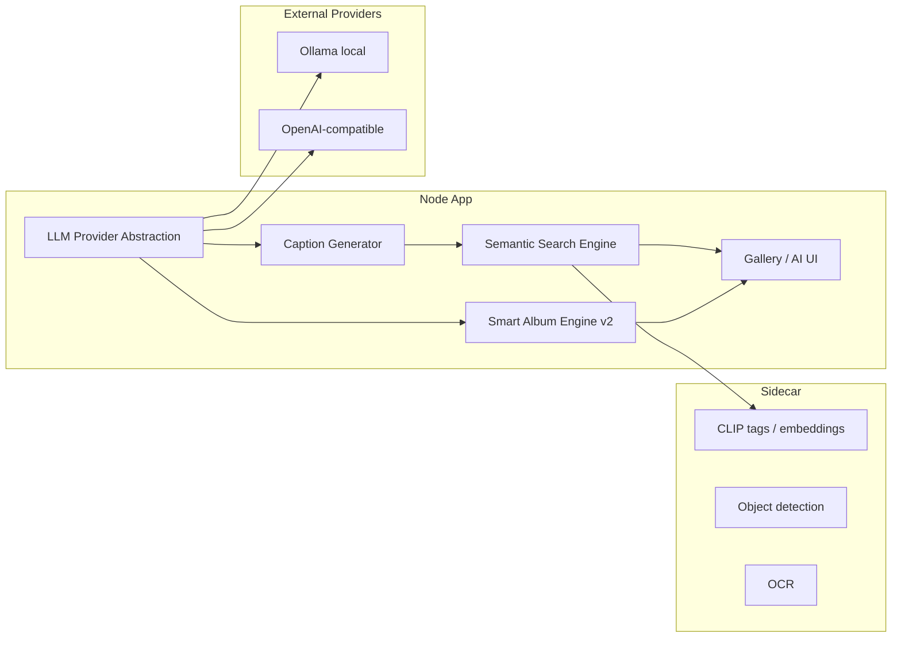
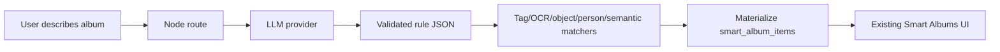

# AI Enhancements - Current Roadmap

Extending the current AI subsystem with provider-backed LLM features,
natural-language search, voice transcription, and smarter album rules.

**Status:** Current-state roadmap for this standalone codebase
**Target version:** v2.19+ incremental work
**Baseline:** current `main` in `buluma/telegram-media-downloader`
**Dependencies:** Existing Python sidecar (`faces-service/`), SQLite, config system

---

## Current Baseline

The app already has a substantial AI surface. This document should not treat the
following as future work:

| Area | Current state |
|---|---|
| Faces / People | Face clustering, person tiles, person photo browser, paged popup viewer |
| NSFW | Review grid, pagination, media-kind filter, popup viewer |
| OCR | Text extraction and OCR counts in the AI hub |
| Objects | Object detection and object counts in the AI hub |
| Image tags | CLIP/zero-shot tags, tag browser, tag photo grid, popup viewer |
| Smart Albums v1 | Tag-rule albums using `smart_albums` and materialized `smart_album_items` |
| Embedding storage | `image_embeddings` table already exists in `src/core/db.js` |

The remaining gaps are not the basic UI shells. The missing pieces are deeper
search, richer rules, provider integration, and audio coverage.

| Gap | Impact |
|---|---|
| No natural-language media search | Users cannot find `dog on a beach` unless tags already line up exactly |
| No integrated LLM provider status/config UI | Captioning and query parsing have no stable backend contract yet |
| No voice/audio transcription | Voice notes and audio files are invisible to search |
| No cross-modal result ranking | OCR text, object tags, face/person signals, captions, and embeddings are not merged into one search path |
| Smart Albums are tag-rule only | Current albums work, but only for `tags_contains` rules |

---

## Design Overview

Four capabilities can land independently, while preserving the current AI page
and Smart Albums v1 behavior.



---

## 1. LLM Provider Abstraction

### Goal

Create one stable interface for text-generation features: caption generation,
query parsing, smart album rule expansion, and future chat-style helpers.
Calling code should not care whether the backend is Ollama, OpenAI-compatible,
Anthropic, or disabled.

### Current Implementation Status

A local scaffold exists under `src/core/llm/`, but it is not yet wired into the
web routes, config UI, tests, or release path. Treat it as the starting point,
not as a shipped feature.

Expected module shape:

```text
src/core/llm/
├── index.js          # Facade: list/probe providers, generate(), chat(), embed()
├── provider.js       # Base provider contract
├── llm-config.js     # config/env resolution
├── ollama.js         # Ollama REST implementation
├── openai.js         # OpenAI-compatible REST implementation
└── _registry.js      # Provider registry and availability probes
```

### Interface

```js
class LLMProvider {
    static id = 'ollama';
    static label = 'Ollama (local)';

    static async probe(config) {}

    async generate({ prompt, systemPrompt, model, temperature, maxTokens }) {}
    async chat({ messages, model, temperature, maxTokens }) {}
    async embed({ texts }) {}

    get supportsVision() {
        return false;
    }
}
```

### Configuration Namespace

Use the existing AI namespace. Do not introduce `config.advanced.llm`.

```jsonc
// config.advanced.ai.llm
{
  "provider": "disabled",      // "disabled" | "ollama" | "openai"
  "ollama": {
    "baseUrl": "http://localhost:11434",
    "model": "qwen3-vl:235b-cloud"
  },
  "openai": {
    "apiKey": "",
    "model": "gpt-4o-mini",
    "baseUrl": ""
  },
  "defaults": {
    "temperature": 0.7,
    "maxTokens": 512
  }
}
```

Environment overrides should follow the existing deployment style, for example
`TGDL_LLM_PROVIDER`, `TGDL_LLM_OLLAMA_BASE_URL`, and `TGDL_LLM_OPENAI_API_KEY`.

### Safe Next Work

| File / area | Change |
|---|---|
| `src/core/llm/` | Land or polish the provider scaffold |
| `src/web/routes/ai.js` | Add read-only provider status/probe endpoints |
| AI maintenance page | Add an `AI runtime setup` panel for provider health and a test prompt |
| Config defaults/sample | Add disabled-by-default `advanced.ai.llm` keys |
| Tests | Mock provider probes and generation calls |

LLM features must degrade cleanly when disabled: hide actions, show a clear
configuration message, and do not block existing AI scans.

---

## 2. Semantic / Natural-Language Search

### Goal

Let users find media by describing it in plain English, such as `dog in a park`,
`people smiling at sunset`, or `screenshot of a receipt`.

### Important Correction

`image_embeddings` is not a new table. It already exists in `src/core/db.js` and
has helper functions in `src/core/db/faces.js`. The missing work is producing,
refreshing, and querying those embeddings consistently from the sidecar and UI.

Current schema:

```sql
CREATE TABLE IF NOT EXISTS image_embeddings (
    download_id INTEGER PRIMARY KEY,
    embedding   BLOB    NOT NULL,
    model       TEXT    NOT NULL,
    indexed_at  INTEGER NOT NULL,
    FOREIGN KEY (download_id) REFERENCES downloads(id) ON DELETE CASCADE
);
```

### How It Should Work

The existing sidecar already runs CLIP-based zero-shot tagging. Extend that path
so it can also return text embeddings and image embeddings for search.

```mermaid
sequenceDiagram
    participant U as Browser
    participant N as Node
    participant S as Sidecar
    participant DB as SQLite

    U->>N: GET /api/ai/search?q=dog+in+a+park
    N->>S: POST /search { text: "dog in a park" }
    S-->>N: { embedding: [...] }
    N->>DB: Load image_embeddings for active model
    N->>N: Cosine rank in memory
    N-->>U: { results: [{ id, filePath, thumbUrl, score }] }
```



### Missing Pieces

| Area | Change |
|---|---|
| Sidecar | Add or stabilize text/image embedding endpoints |
| `src/core/ai/index.js` | Add embedding producer/backfill orchestration |
| `src/core/db/faces.js` | Reuse existing embedding helpers for coverage and cosine search |
| `src/web/routes/ai.js` | Add `GET /api/ai/search` and embedding backfill controls |
| AI UI | Add semantic search input, coverage count, and re-index action |

### Backfill Behavior

The background AI scan should compute embeddings for image rows when semantic
search is enabled. A manual `Re-index embeddings` button should process rows
that are missing embeddings for the active model.

Model changes must be safe: either keep embeddings by model or delete/rebuild
only rows for stale models. Do not silently mix scores from different embedding
models.

### Performance Notes

| Concern | Mitigation |
|---|---|
| 100k image cosine scan | In-memory cosine over stored blobs is acceptable initially; defer ANN/HNSW |
| CPU-only CLIP text query | Cache repeated query embeddings and show progress for slow sidecars |
| Storage | One 512-dim float32 embedding is about 2 KB per image |

---

## 3. Smart Album Engine v2

### Current v1 Behavior

Smart Albums already exist and are safe to keep. The current implementation:

| Piece | Current behavior |
|---|---|
| Storage | `smart_albums` stores `name`, `rule_json`, `enabled`, `sort_key`, timestamps |
| Materialized items | `smart_album_items` stores album/download matches |
| Rule type | Only `{ type: 'tags_contains', tag, minScore }` |
| API | Current routes are under `/api/ai/smart-albums` |
| UI | Create album, choose tag, set confidence, rebuild, delete, paged photo popup |
| Staleness | UI can show `Needs rebuild` when tag scans are newer than album items |

### Goal

Extend v1 rather than replace it. v2 should turn natural-language album ideas
into explicit rule JSON that the app can execute and validate.

Example future rule:

```jsonc
{
  "type": "compound",
  "all": [
    { "type": "tags_contains", "tag": "beach", "minScore": 0.55 },
    { "type": "people_count", "min": 2 },
    { "type": "semantic", "query": "smiling at sunset", "minScore": 0.7 }
  ],
  "sort": "score_desc"
}
```

### Engine Flow



### LLM Query Parser Contract

The LLM should produce only validated JSON. Node owns validation and execution.
Never execute arbitrary SQL generated by an LLM.

Allowed future filter fields:

```jsonc
{
  "people_count": { "min": 2 },
  "tags": [{ "name": "beach", "minScore": 0.55 }],
  "objects": ["person", "dog"],
  "text_contains": "receipt",
  "semantic_query": "smiling at sunset",
  "date_from": "2025-06-01",
  "date_to": "2025-09-01",
  "file_type": "photo"
}
```

### Safe Extension Points

| File / area | Change |
|---|---|
| `src/core/db/faces.js` | Extend `_normalizeSmartAlbumRule()` and `rebuildSmartAlbum()` |
| `src/web/routes/ai.js` | Keep `/api/ai/smart-albums`; add parse/preview endpoints if needed |
| `src/core/llm/index.js` | Add `parseMediaQuery()` helper after provider scaffold is stable |
| AI maintenance page | Add optional natural-language builder without removing tag-rule builder |
| Tests | Cover rule validation, rebuild behavior, disabled provider fallback |

---

## 5. Integration And UI Surface

The AI maintenance page is now the correct home for these controls. Avoid adding
new detached pages unless the feature needs a full gallery route.

| Section | Current state | Next addition |
|---|---|---|
| AI runtime setup | Label exists; provider wiring pending | Provider health, model selector, test prompt |
| People | Current browser and popup work | Optional person filters in search/smart albums |
| Tag Browser | Current grid, pagination, popup, create-album flow | Feed semantic search and album preview |
| Smart Albums | Current v1 tag-rule albums | Natural-language builder and compound rules |
| OCR / Objects | Counts exist | Include in cross-modal search |
| Semantic Search | Not exposed | Search bar, coverage count, re-index button |

### Gallery/Search Behavior

A future search box should combine three layers:

1. Client-side filename/group filter for immediate feedback.
2. Full-text search over OCR/captions.
3. Semantic search over image embeddings.

Results should use the same photo grid and popup behavior already used by NSFW,
Tag Browser, Smart Albums, and People photo views.

---

## 6. Config Additions

All new features must default to disabled or passive behavior.

```jsonc
// config.advanced.ai additions
{
  "semanticSearch": {
    "enabled": false,
    "embedOnDownload": false,
    "batchSize": 32
  },
  "smartAlbums": {
    "enabled": true,
    "refreshIntervalMin": 15,
    "allowLlmRules": false
  },
  "llm": {
    "provider": "disabled",
    "ollama": {
      "baseUrl": "http://localhost:11434",
      "model": "qwen3-vl:235b-cloud"
    },
    "openai": {
      "apiKey": "",
      "model": "gpt-4o-mini",
      "baseUrl": ""
    }
  }
}
```

---

## 7. Implementation Order

| Phase | Feature | Depends on | Risk |
|---|---|---|---|
| 0 | Align docs/tests with current AI baseline | Nothing | Low |
| 1 | Land LLM provider scaffold behind disabled config | Nothing | Low-medium |
| 2 | Provider status route and AI runtime setup UI | Phase 1 | Low |
| 3 | Semantic embedding backfill using existing `image_embeddings` | Sidecar embedding support | Medium |
| 4 | Search API and shared popup grid UI | Phase 3 | Medium |
| 5 | Smart Albums v2 compound rules | Phase 3, optional Phase 1 | Medium |
| 6 | Cross-modal result ranking | Phases 3, 5 | Higher |

Ship each phase independently. Existing People, Tag Browser, NSFW, and Smart
Albums v1 must keep working if every new feature flag is disabled.

---

## 8. Migration Rules

For existing installs:

- Do not rename or remove `smart_albums` or `smart_album_items`.
- Preserve existing `tags_contains` album rules exactly.
- Do not recreate `image_embeddings`; reuse it and rebuild rows only when the
  embedding model changes.
- New config keys default to disabled/passive.
- New sidecar endpoints are additive.
- Schema changes must stay idempotent with `CREATE TABLE IF NOT EXISTS` or safe
  `ALTER TABLE` guards.

For Docker installs:

- Existing compose files should continue to run without enabling LLM or semantic search.
- Sidecar image additions must be optional at runtime and should not require GPU.

---

## 9. Rejected Alternatives

| Approach | Why rejected |
|---|---|
| PostgreSQL/pgvector requirement | Breaks the SQLite-first deployment model |
| External vector DB | Adds operational cost before the library size needs it |
| LLM-generated SQL | Unsafe and hard to validate; use generated rule JSON instead |
| OpenAI-only embeddings | Makes self-hosted installs dependent on paid APIs |
| Replacing Smart Albums v1 | Existing tag-rule albums are useful and low-risk; extend them instead |

---

## 10. Future Work

| Idea | Why wait |
|---|---|
| Approximate nearest-neighbour index | Only needed when in-memory cosine becomes too slow |
| AI deduplication | Depends on reliable embeddings first |
| Multi-modal RAG over all media | Needs captions, OCR, and semantic search mature first |
| Content-aware scheduling | Needs months of stable activity history and lower-priority analytics |
