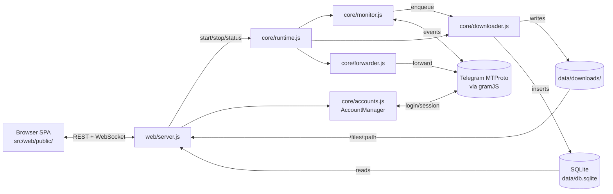

# Architecture

Two top-level entry points share state through `data/`:

1. **CLI** (`src/index.js`) — interactive menus, ad-hoc commands.
2. **Web server** (`src/web/server.js`) — Express + WebSocket on `:3000`, serves the SPA from `src/web/public/`.

Both load the same `data/config.json` and `data/db.sqlite` (WAL mode → safe shared reads, single writer).

## Request flow



## Data layout (gitignored)

```
data/
├── config.json           # canonical settings (deep-merged on load)
├── db.sqlite             # downloads, queue, share_links — WAL mode
├── secret.key            # AES key for sessions; back this up
├── web-sessions.json     # active dashboard tokens (each carries a role)
├── sessions/<id>.enc     # per-account scrypt+AES-GCM encrypted sessions
├── photos/<id>.jpg       # cached chat profile photos
├── downloads/            # canonical media tree
│   └── <sanitised-group-name>/
│       ├── images/  videos/  documents/  audio/  stickers/
├── thumbs/<sha>.webp     # server-generated WebP thumbnails (cache)
├── models/               # NSFW model cache (only when feature is enabled)
├── backups/              # pre-update DB snapshots (last 5 kept)
└── logs/
    ├── network.log       # noise-classified gramJS chatter
    └── protection_log.txt
```

## Multi-account routing

`AccountManager` (`src/core/accounts.js`) holds `Map<accountId, TelegramClient>`. Each `.enc` session file under `data/sessions/` becomes one connected client.

When `RealtimeMonitor.start()` runs, it walks every enabled group and asks each loaded client whether it can read it (`getMessages(groupId, {limit:1})`); the first one that succeeds is cached in `groupClientCache`. A group can pin an explicit account via `group.monitorAccount` — that wins.

When editing monitor / forwarder / history code, never assume `this.client` is the right client for a given group — go through `getClientForGroup(group)`.

## Web auth

Auth is opaque sessions, not passwords:

1. CLI or web setup hashes the password with **scrypt** (per-password random salt) and stores it as `config.web.passwordHash = {algo:'scrypt', salt, hash, …}`.
2. Login posts the password, server tries the admin hash first then the optional `guestPasswordHash`, verifies via `crypto.timingSafeEqual`, and issues a 64-char hex token persisted to `data/web-sessions.json` along with the resolved role.
3. The token is sent back as cookie `tg_dl_session` with `httpOnly`, `sameSite=strict`, and `secure` in production.
4. Every API call (and the WebSocket upgrade) re-validates the token with `validateSession(token)` and sets `req.role` for downstream middleware.

A default-deny chokepoint mounted right after `checkAuth` allowlists only the read-only routes that guests are allowed to hit (`/api/downloads*`, `/api/stats`, `/api/groups` GET, `/api/monitor/status`, `/api/queue/snapshot`, `/api/history*` GET, `/api/thumbs/*`, `POST /api/logout`); every mutation route returns `403 {adminRequired:true}` for guest sessions by construction. New mutation endpoints are admin-gated for free.

If no auth is configured the dashboard **fails closed** — `/setup-needed.html` walks first-time users through setting a password (only allowed from `127.0.0.1`).

## Share-link route

`GET /share/<linkId>?exp=<epoch>&sig=<base64url>` is registered BEFORE `checkAuth` and listed in `PUBLIC_PATH_PREFIXES`. Three independent gates protect it:

1. Per-IP rate limiter (configurable via `advanced.share.rateLimit{Window,Max}`).
2. HMAC-SHA256 signature check via `crypto.timingSafeEqual` (length-checked first).
3. DB row in `share_links` — must exist, not be revoked, and either have `expires_at = 0` (the "never expires" sentinel) or `expires_at > now()`.

All failure modes return 401 with a body `code` (`bad_sig` / `revoked` / `expired`) so an external scanner can't enumerate which link IDs exist.

## Engine queue

`Downloader` runs N workers (1–20, auto-scaled). The queue is split:

- `_high[]` — realtime (priority 1) and TTL/self-destruct (priority 0, unshifted to the front).
- `queue[]` — history backfill (priority 2). Spills to `data/logs/queue_backlog.jsonl` past 2000 entries.

Workers always drain `_high` first, then `queue`, then rehydrate from disk. Realtime never starves behind backfill.

## Logger noise classifier

gramJS surfaces a steady stream of recoverable internals during reconnects (`TIMEOUT`, `Not connected`, `Connection closed`, `Reconnect`, `CHANNEL_INVALID`). The previous codebase silently dropped these via a global `console.error` filter that also swallowed real errors with the same words.

`src/core/logger.js` now classifies: noise still gets logged to `data/logs/network.log` but is only echoed to stderr when `TGDL_DEBUG=1` (or `DEBUG`). Real errors go through unchanged.

## SPA modules

```
src/web/public/js/
├── app.js            # router + init, group/dialog rendering, gallery grid
├── api.js            # fetch wrapper (401 → /login, 503 → /setup, 403 → toast)
├── ws.js             # WebSocket client with auto-reconnect
├── store.js          # state container (carries `role` + `selected`)
├── router.js         # hash router with admin-route redirect for guest sessions
├── settings.js       # Settings page + accounts + proxy + security + maintenance
├── nsfw-ui.js        # NSFW review sheet (lazy-loaded from settings.js)
├── share.js          # Share-link sheet (lazy-loaded from viewer + settings)
├── gallery-select.js # Drag-to-select lasso + ctrl/shift gestures + keyboard
├── viewer.js         # full-screen media viewer
├── queue.js          # IDM-style queue page (append-on-scroll, in-place patch)
├── backfill.js       # Backfill page (active jobs + recent + start)
├── engine.js         # Engine card (start/stop/status)
├── statusbar.js      # sticky footer + version chip + update chooser sheet
├── theme.js          # light/dark/auto toggle
├── fonts.js          # font registry + boot-time preloader
├── notifications.js  # opt-in browser toasts
├── monitor-status.js # shared monitor-status subscription (single fetch, many subscribers)
├── i18n.js           # data-i18n helper + lockstep en/th
├── sheet.js          # themed bottom-sheet replacement for native dialogs
└── utils.js          # formatters + escapeHtml + showToast
```

The SPA is vanilla ES Modules served over HTTP — no bundler, no build step. Asset URLs are cache-busted via `?v=<APP_VERSION>` so a fresh deploy is picked up immediately while unchanged versions stay cached as `immutable`.

## Backend modules

```
src/core/
├── accounts.js       # AccountManager — multi-account routing
├── monitor.js        # RealtimeMonitor — gramJS event handler + polling fallback
├── downloader.js     # DownloadManager — queue + workers + atomic writes
├── history.js        # HistoryDownloader — backfill with smart-resume modes
├── forwarder.js      # AutoForwarder — post-download forward to destination
├── checksum.js       # Canonical SHA-256 helper (used by downloader + dedup)
├── dedup.js          # On-demand library-wide duplicate scan
├── thumbs.js         # WebP thumbnail generator (sharp + ffmpeg fallback)
├── nsfw.js           # NSFW classifier (WASM, Falconsai/nsfw_image_detection)
├── share.js          # HMAC-SHA256 share-link sign/verify + secret bootstrap
├── updater.js        # Watchtower client + pre-update DB snapshot
├── web-auth.js       # scrypt password hashing + role-aware sessions
├── db.js             # SQLite schema + migrations + helpers
├── runtime.js        # Engine lifecycle (monitor + downloader + forwarder)
├── disk-rotator.js   # Auto-prune oldest downloads when over quota
├── integrity.js      # Hourly file-existence sweep
├── rescue.js         # Rescue-mode sweeper (TTL-based prune)
├── stories.js        # Stories list + download adapters
├── url-resolver.js   # t.me / tg:// URL parsing
├── security.js       # RateLimiter + SecureSession (AES-256-GCM)
├── secret.js         # data/secret.key bootstrap
├── metrics.js        # OpenMetrics text format for Prometheus
└── logger.js         # noise classifier + WAL'd network log
```
