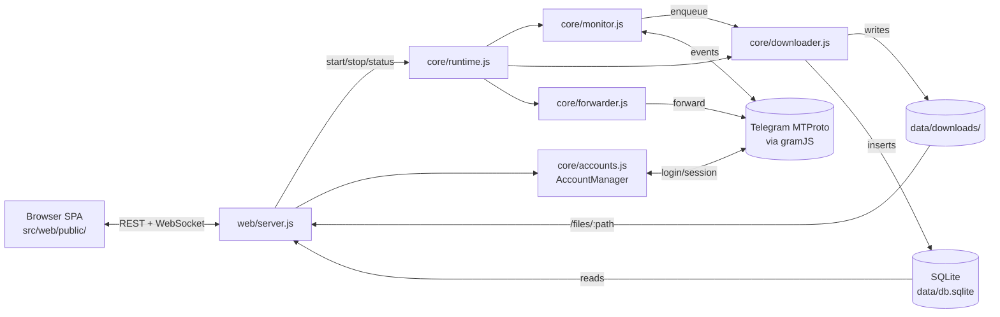

# Architecture

Two top-level entry points share state through `data/`:

1. **CLI** (`src/index.js`) — interactive menus, ad-hoc commands.
2. **Web server** (`src/web/server.js`) — Express + WebSocket on `:3000`, serves the SPA from `src/web/public/`.

Both load the same `data/config.json` and `data/db.sqlite` (WAL mode → safe shared reads, single writer).

## Request flow



## Data layout (gitignored)

```
data/
├── config.json           # canonical settings (deep-merged on load)
├── db.sqlite             # downloads + queue tables, WAL mode
├── secret.key            # AES key for sessions; back this up
├── web-sessions.json     # active dashboard tokens
├── sessions/<id>.enc     # per-account scrypt+AES-GCM encrypted sessions
├── photos/<id>.jpg       # cached chat profile photos
├── downloads/            # canonical media tree
│   └── <sanitised-group-name>/
│       ├── images/  videos/  documents/  audio/  stickers/
└── logs/
    ├── network.log       # noise-classified gramJS chatter
    └── protection_log.txt
```

## Multi-account routing

`AccountManager` (`src/core/accounts.js`) holds `Map<accountId, TelegramClient>`. Each `.enc` session file under `data/sessions/` becomes one connected client.

When `RealtimeMonitor.start()` runs, it walks every enabled group and asks each loaded client whether it can read it (`getMessages(groupId, {limit:1})`); the first one that succeeds is cached in `groupClientCache`. A group can pin an explicit account via `group.monitorAccount` — that wins.

When editing monitor / forwarder / history code, never assume `this.client` is the right client for a given group — go through `getClientForGroup(group)`.

## Web auth

Auth is opaque sessions, not passwords:

1. CLI or web setup hashes the password with **scrypt** (per-password random salt) and stores it as `config.web.passwordHash = {algo:'scrypt', salt, hash, …}`.
2. Login posts the password, server verifies via `crypto.timingSafeEqual`, then issues a 64-char hex token persisted to `data/web-sessions.json`.
3. The token is sent back as cookie `tg_dl_session` with `httpOnly`, `sameSite=strict`, and `secure` in production.
4. Every API call (and the WebSocket upgrade) re-validates the token with `validateSession(token)`.

If no auth is configured the dashboard **fails closed** — `/setup-needed.html` walks first-time users through setting a password (only allowed from `127.0.0.1`).

## Engine queue

`Downloader` runs N workers (1–20, auto-scaled). The queue is split:

- `_high[]` — realtime (priority 1) and TTL/self-destruct (priority 0, unshifted to the front).
- `queue[]` — history backfill (priority 2). Spills to `data/logs/queue_backlog.jsonl` past 2000 entries.

Workers always drain `_high` first, then `queue`, then rehydrate from disk. Realtime never starves behind backfill.

## Logger noise classifier

gramJS surfaces a steady stream of recoverable internals during reconnects (`TIMEOUT`, `Not connected`, `Connection closed`, `Reconnect`, `CHANNEL_INVALID`). The previous codebase silently dropped these via a global `console.error` filter that also swallowed real errors with the same words.

`src/core/logger.js` now classifies: noise still gets logged to `data/logs/network.log` but is only echoed to stderr when `TGDL_DEBUG=1` (or `DEBUG`). Real errors go through unchanged.

## SPA modules

```
src/web/public/js/
├── app.js            # router + init, group/dialog rendering
├── api.js            # fetch wrapper (handles 401/503 → redirect)
├── ws.js             # WebSocket client with auto-reconnect
├── store.js          # state container
├── settings.js       # Settings page + accounts + proxy + security
├── viewer.js         # full-screen media viewer
├── engine.js         # Engine card (start/stop/status)
├── statusbar.js      # sticky footer with live counters
├── theme.js          # light/dark/auto toggle
├── notifications.js  # opt-in browser toasts
└── utils.js          # formatters + escapeHtml + showToast
```

The SPA is vanilla ES Modules served over HTTP — no bundler, no build step.
